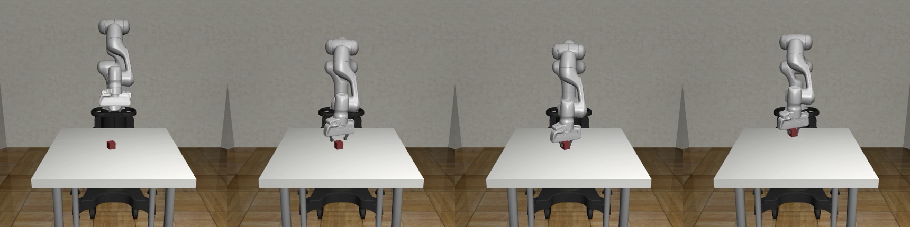
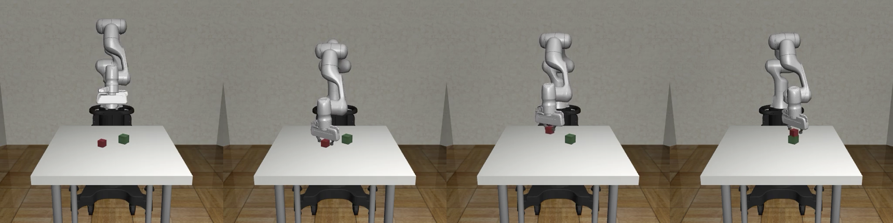
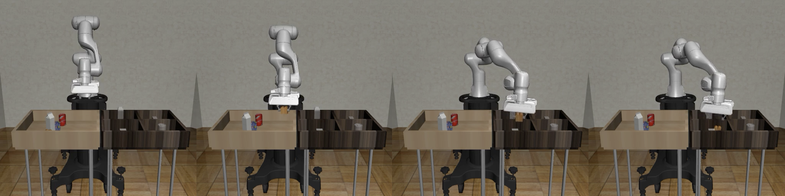
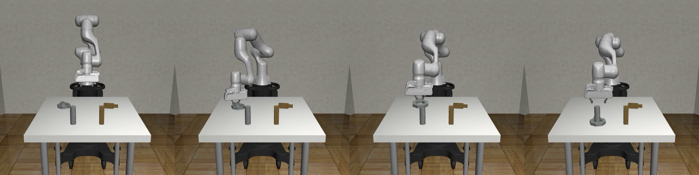
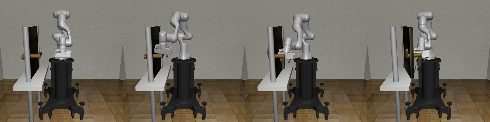
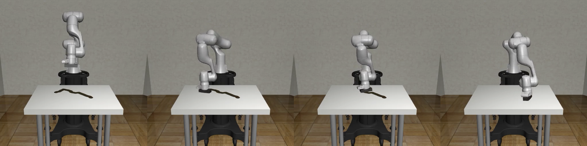
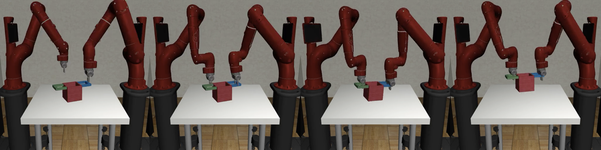
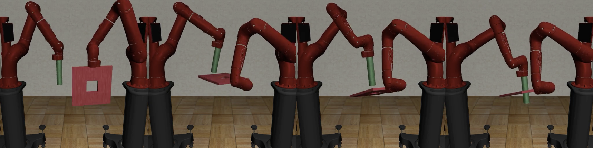
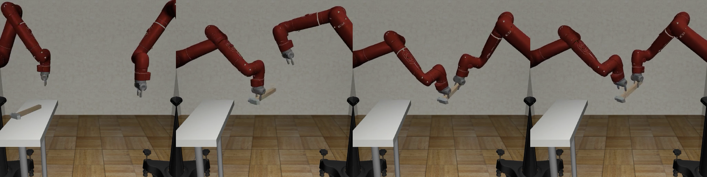

# Environments

Environments are the main **robosuite** API objects that external code will interact with. Each environment corresponds to a robot manipulation task and provides a standard interface for an agent to interact with the environment. While **robosuite** can support environments from different robotic domains, the current release focuses is on manipulation environments.

Next, we will describe how to create an environment, how to interact with an environment, and how each environment creates a simulated task in the MuJoCo physics engine. We will use the `TwoArmLift` environment as a running example for each section.

## Making an Environment

Environments are created by calling `robosuite.make` with the name of the task and with a set of arguments that configure environment properties. For making an environment in `robosuite-task-zoo`, put the object definition under `robosuite_task_zoo/environments/manipulation`, and models of objects under `robosuite_task_zoo/models/ENV_NAME_FOLDER/`.

## Task Models

For more details of task models, please refer to [robosuite Task Models](https://robosuite.ai/docs/modules/environments.html#task-models).

## Task Descriptions

We provide a brief description of each environment included in this repo. The current focuse is on manipulation environments.

### Single-Arm Tasks

#### Block Lifting

- **Scene Description**: A cube is placed on the tabletop in front of a single robot arm.
- **Goal**: The robot arm must lift the cube above a certain height.
- **Start State Distribution**: The cube location is randomized at the beginning of each episode.

#### Block Stacking

- **Scene Description**: Two cubes are placed on the tabletop in front of a single robot arm.
- **Goal**: The robot must place one cube on top of the other cube. 
- **Start State Distribution**: The cube locations are randomized at the beginning of each episode.

#### Pick-and-Place

- **Scene Description**: Four objects are placed in a bin in front of a single robot arm. There are four containers next to the bin.
- **Goal**: The robot must place each object into its corresponding container. This task also has easier single-object variants.
- **Start State Distribution**: The object locations are randomized at the beginning of each episode.

#### Nut Assembly

- **Scene Description**: Two colored pegs (one square and one round) are mounted on the tabletop, and two colored nuts (one square and one round) are placed on the table in front of a single robot arm.
- **Goal**: The robot must fit the square nut onto the square peg and the round nut onto the round peg. This task also has easier single nut-and-peg variants.
- **Start State Distribution**: The nut locations are randomized at the beginning of each episode.

#### Door Opening

- **Scene Description**: A door with a handle is mounted in free space in front of a single robot arm.
- **Goal**: The robot arm must learn to turn the handle and open the door.
- **Start State Distribution**: The door location is randomized at the beginning of each episode.

#### Table Wiping

- **Scene Description**: A table with a whiteboard surface and some markings is placed in front of a single robot arm, which has a whiteboard eraser mounted on its hand.
- **Goal**: The robot arm must learn to wipe the whiteboard surface and clean all of the markings.
- **Start State Distribution**: The whiteboard markings are randomized at the beginning of each episode.

### Two-Arm Tasks

#### Two Arm Lifting

- **Scene Description**: A large pot with two handles is placed on a table top. Two robot arms are placed on the same side of the table or on opposite ends of the table.
- **Goal**: The two robot arms must each grab a handle and lift the pot together, above a certain height, while keeping the pot level.
- **Start State Distribution**: The pot location is randomized at the beginning of each episode.

#### Two Arm Peg-In-Hole

- **Scene Description**: Two robot arms are placed either next to each other or opposite each other. One robot arm holds a board with a square hole in the center, and the other robot arm holds a long peg.
- **Goal**: The two robot arms must coordinate to insert the peg into the hole.
- **Start State Distribution**: The initial arm configurations are randomized at the beginning of each episode.

#### Two Arm Handover

- **Scene Description**: A hammer is placed on a narrow table. Two robot arms are placed on the same side of the table or on opposite ends of the table.
- **Goal**: The two robot arms must coordinate so that the arm closer to the hammer picks it up and hands it to the other arm.
- **Start State Distribution**: The hammer location and size is randomized at the beginning of each episode.
