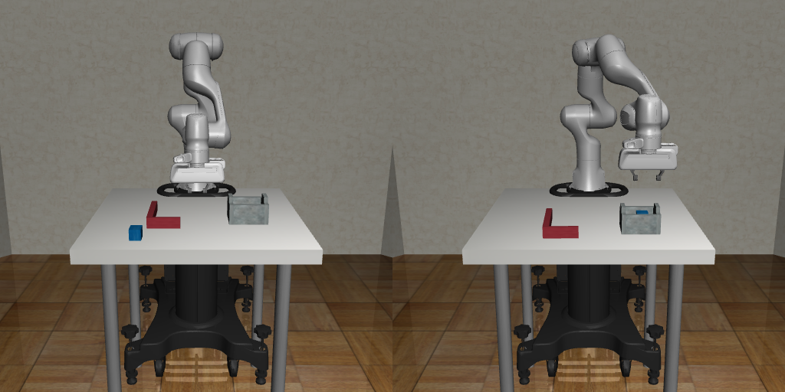
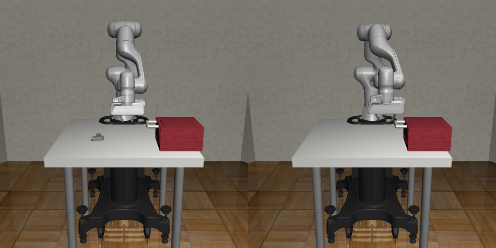
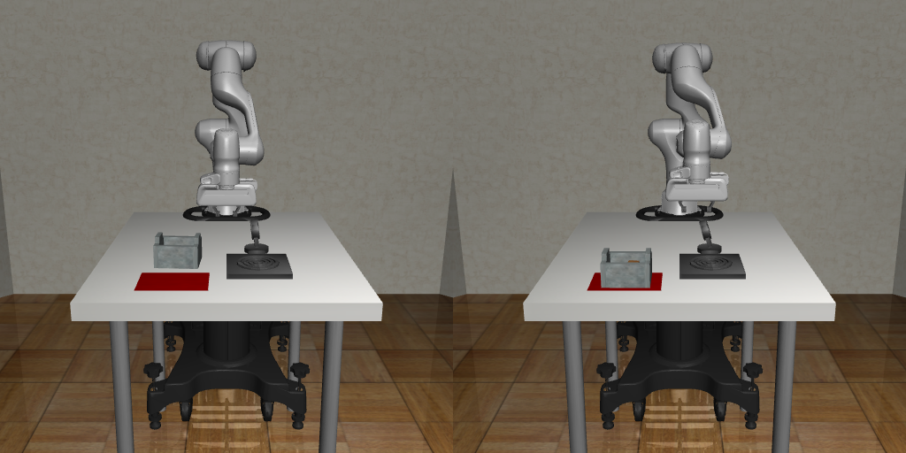

# Environments

Enviornments are based on robosuite, and for more information on the
details of robosuite, including how to create an environment, please
refer to [robosuite doc](https://robosuite.ai/docs)

We describe the tasks included in this repository.

## Task Descriptions

We provide a brief description of each environment included in this repo. The current focuse is on manipulation environments.

### ToolUse

- **Description**: A simple tabletop domain to place a hammer into the cabinet
  and close the cabinet.
- **Robot-type**: Single-Arm
- **Task-type**: Single-Task
- **Has rewards**: Yes
- **Has demonstrations**: Yes
  - **No. of Demonstrations**: 100
  - **Robot**: Panda
- **Action Space**: OSC_POSITION (3) + Gripper (1)
- **Observations**: Workspace images, Eye-in-Hand images, Proprioception
- **Reference**: [Bottom-Up Skill Discovery from Unsegmented Demonstrations for Long-Horizon Robot Manipulation](paper_link)

### HammerPlace

- **Description**: A simple tabletop domain to place a hammer into the cabinet
  and close the cabinet.
- **Robot-type**: Single-Arm
- **Task-type**: Single-Task
- **Has rewards**: Yes
- **Has demonstrations**: Yes
  - **No. of Demonstrations**: 100
  - **Robot**: Panda
- **Action Space**: OSC_POSITION (3) + Gripper (1)
- **Observations**: Workspace images, Eye-in-Hand images, Proprioception
- **Reference**: [Bottom-Up Skill Discovery from Unsegmented Demonstrations for Long-Horizon Robot Manipulation](paper_link)

### Kitchen

- **Description**: A simple tabletop domain to place a hammer into the cabinet
  and close the cabinet.
- **Robot-type**: Single-Arm
- **Task-type**: Single-Task
- **Has rewards**: Yes
- **Has demonstrations**: Yes
  - **No. of Demonstrations**: 100
  - **Robot**: Panda
- **Action Space**: OSC_POSITION (3) + Gripper (1)
- **Observations**: Workspace images, Eye-in-Hand images, Proprioception
- **Reference**: [Bottom-Up Skill Discovery from Unsegmented Demonstrations for Long-Horizon Robot Manipulation](paper_link)

### MultitaskKitchenDomain

- **Description**: A simple tabletop domain to place a hammer into the cabinet
  and close the cabinet.
- **Robot-type**: Single-Arm
- **Task-type**: Multi-Task
  - **No. of Tasks**: 3
- **Has rewards**: Yes
- **Has demonstrations**: Yes
  - **No. of Demonstrations in total**: 360
  - **No. of Demonstrations each task**: 120
  - **Robot**: Panda
- **Action Space**: OSC_POSITION (3) + Gripper (1)
- **Observations**: Workspace images, Eye-in-Hand images, Proprioception
- **Reference**: [Bottom-Up Skill Discovery from Unsegmented Demonstrations for Long-Horizon Robot Manipulation](paper_link)

